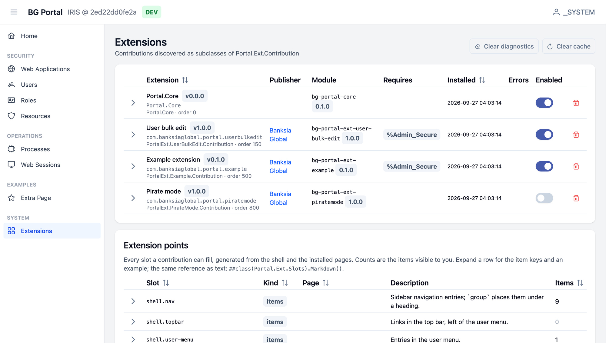

# IRIS Portal

An extensible management portal for InterSystems IRIS. Server-rendered ObjectScript
pages carrying Vue templates, a thin `Banksia.Bloom` runtime, and a declarative
extension registry.



See [`docs/architecture.md`](docs/architecture.md) for the architecture,
how to add a page and how to write an extension,
[`docs/writing-an-extension.md`](docs/writing-an-extension.md) for the extension API
(columns, actions, fields, widgets, components), and
[`docs/adding-a-management-screen.md`](docs/adding-a-management-screen.md) for the
recipe behind the Web Application / User screens.

## Demo

A live demo runs at <https://portal.cloud.banksia.global> until November 2026. It runs
the latest published Docker image, and the container is recreated every 10 minutes,
so any changes you make there are discarded.

The demo is deployed with the CloudFormation template in
[`cloudformation/iris-portal-ec2.yaml`](cloudformation/iris-portal-ec2.yaml). It
sets up an EC2 instance with an Elastic IP, running the image behind nginx with a
Let's Encrypt certificate. Use it to host your own copy.

## Layout

```
src/cls/Banksia/Bloom/   Page + Component runtime (ObjectScript class -> Vue instance, WebMethod proxying)
src/cls/Portal/          the portal: shell, registry, core contribution, screens
src/vue/                 frontend entry (PrimeVue, Tailwind, the few global Vue components)
src/csp/portal/          CSP application root; ui/ is the build output (ignored)
module.xml               ZPM module: packages + /csp/portal web application
```

## Extensions

Extensions are ObjectScript classes extending `Portal.Ext.Contribution`, packaged as
their own ZPM modules under `extensions/<module>/` (convention `portal-ext-*`), each
with a `module.xml` and its own package. The
reference implementation is `extensions/portal-ext-example/` (package
`PortalExt.Example`), which the dev image loads after core so a fresh
`docker compose up --build` shows it; it is just a normal module so you can
`zpm "uninstall bg-portal-ext-example"`.

To load or reload an extension in the running dev container (the `extensions/` folder
is mounted at `/home/irisowner/extensions/`):

```bash
docker compose exec iris iris session IRIS -U USER 'zpm "load /home/irisowner/extensions/portal-ext-example"'
```

See [`docs/writing-an-extension.md`](docs/writing-an-extension.md) for the API,
manifest, lifecycle hooks and module layout.

## Run with Docker

A prebuilt image with the core portal and the sample, user bulk change and (disabled)
pirate mode extensions is published on every push to `main`:

```bash
docker run -d --name iris-portal -p 52773:52773 -p 1972:1972 \
  ghcr.io/banksiaglobal/bg-portal:latest
```

Open <http://localhost:52773/csp/portal/Portal.Home.cls> and log in as `_SYSTEM` /
`SYS`.

## Install with ZPM

The modules are published as public packages to the `banksiaglobal` namespace on
GitHub Container Registry. In an IRIS terminal with ZPM installed, add the registry
(no repo credentials needed to install):

```objectscript
zn "USER"
zpm "repo -o -n banksiaglobal -url ghcr.io -namespace banksiaglobal"
```

Install the core portal and the extensions:

```objectscript
zpm "install bg-portal-core"
zpm "install bg-portal-ext-example"          // sample extension
zpm "install bg-portal-ext-user-bulk-edit"   // bulk change form for users
```

Optionally, install pirate mode:

```objectscript
zpm "install bg-portal-ext-piratemode"
```

It is enabled as soon as it is installed. To keep it installed but switched off:

```objectscript
do ##class(Portal.Ext.Registry).SetEnabled("PortalExt.PirateMode.Contribution", 0)
```

(pass `1` to switch it back on). Then open `/csp/portal/Portal.Home.cls` on the
instance's web server.

## Build and develop locally

```bash
docker compose up -d --build     # IRIS on http://localhost:59873, SuperServer 59872
nvm use && npm ci
npm run build-only               # or `npm run watch` during development
```

Open <http://localhost:59873/csp/portal/Portal.Home.cls> and log in with an IRIS
account holding `%Admin_Secure` (e.g. `_SYSTEM` / `SYS` in the dev container).

To reload classes after editing without rebuilding the image:

```bash
docker compose exec iris iris session IRIS -U USER \
  '##class(%SYSTEM.OBJ).LoadDir("/home/irisowner/src/cls","ck",,1)'
```

## Instance identity

Every page shows which system it is acting on. Set once per instance:

```objectscript
set ^Portal.Config("SYSTEM_NAME") = "Claims prod-eu-1"
set ^Portal.Config("SYSTEM_TYPE") = "LIVE"   ; LIVE | TEST | DEV (default DEV)
```

## Development notes

- Pages extend `Portal.Page`; the shell (`Portal.Layout`) wraps every class under the
  `Portal` package automatically.
- `ClientMethod`s are emitted into the Vue `methods` block; they are `async` only when
  the body contains `await`, so plain helpers can be used in template expressions.
- Anything referenced from an XData template as a component must be registered in
  `src/vue/components.ts` (PrimeVue components are registered in `primeVue.ts`) —
  except Bloom components, which pages emit and register at request time.
- Tailwind scans `src/cls` for class names, so a new utility class in a template
  needs a rebuild of the frontend bundle.

## License

Copyright (c) Banksia Global, 2026.

This program is free software: you can redistribute it and/or modify
it under the terms of the GNU Affero General Public License as published
by the Free Software Foundation, either version 3 of the License, or
(at your option) any later version.

This program is distributed in the hope that it will be useful,
but WITHOUT ANY WARRANTY; without even the implied warranty of
MERCHANTABILITY or FITNESS FOR A PARTICULAR PURPOSE.  See the
GNU Affero General Public License for more details.

You should have received a copy of the GNU Affero General Public License
along with this program.  If not, see <http://www.gnu.org/licenses/>.
